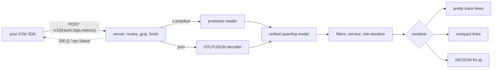

# otelcat

[English](README.md) | [中文](README.zh.md) | [日本語](README.ja.md)

[](LICENSE) [](go.mod) [](CHANGELOG.md)  [](CONTRIBUTING.md)

**otelcat：オープンソース・依存ゼロの OTLP ターミナルシンク — SDK を http://127.0.0.1:4318 に向けるだけで、span が即座にターミナルに整形表示される。Collector も Jaeger も YAML も不要。**


```bash
git clone https://github.com/JaydenCJ/otelcat && cd otelcat
go build -o otelcat ./cmd/otelcat    # single static binary, stdlib only
```

> プレリリース：v0.1.0 はまだパッケージレジストリに公開されていません。上記の手順でソースからビルドしてください（Go ≥1.22 であれば可）。

## なぜ otelcat？

OpenTelemetry 導入者の最初の 1 時間は誰でも同じ疑問から始まる：*「そもそも SDK はデータを出しているのか？」* 既存の標準的な答えはこの用途にはどれも大げさすぎる。Collector と Jaeger を立ち上げるには設定ファイル 1 つ、コンテナ 2 つ、ブラウザタブ 1 つが必要——たった 1 つの span を確認するために。Collector 付属の debug exporter にも Collector とその YAML が要る。`otel-cli` が解くのは逆の問題だ（span を*送る*ツールで、受け取れない）。SDK の console exporter を使うなら、アプリの exporter 配線——まさに検証したいコードそのもの——を書き換えることになり、プロセスから実際に出ていくものは観測できない。otelcat は OTLP に欠けていた `netcat` である：バイナリ 1 つ、設定ゼロ、依存ゼロ。SDK が最初からデフォルトにしているポートで待ち受け、OTLP/HTTP の両エンコーディングに対応し（protobuf は手書きの wire デコーダ——生成コードなし、protobuf ランタイムなし）、バッチが届いた瞬間に trace ごとの色付きツリーとして、所要時間・ステータス・属性・イベント・関連ログまで描画する。

| | otelcat | Collector + debug exporter | Jaeger all-in-one | otel-cli | SDK console exporter |
|---|---|---|---|---|---|
| OTLP over HTTP を受信（protobuf + JSON） | ✅ | ✅ | ✅ | ❌ 送信専用 | n/a |
| 最初の span まで設定ゼロ | ✅ | ❌ YAML 必須 | ❌ コンテナ + UI | n/a | ❌ コード変更 |
| ターミナルで span をライブ表示 | ✅ trace ツリー | ⚠️ 生ダンプ | ❌ ブラウザ | ❌ | ⚠️ 生ダンプ |
| 実際のエクスポート経路を観測 | ✅ | ✅ | ✅ | ❌ | ❌ exporter を迂回 |
| ランタイム依存 | 0 | 約 200 の Go モジュール | コンテナイメージ | バイナリ 1 つ | あなたの SDK |
| バイナリサイズ | strip 後約 6 MB | >200 MB | >60 MB イメージ | 約 9 MB | n/a |

<sub>依存数は 2026-07-13 に確認：otelcat は Go 標準ライブラリのみを import。opentelemetry-collector のコア `go.mod` はディストリビューションを組む前の時点で約 200 モジュールを列挙している。</sub>

## 特徴

- **即時 trace ツリー** — エクスポートバッチごとに trace 単位のツリーを即描画：親子ガイド線、開始時刻順ソート、桁揃えされた人間可読の所要時間（`4.2µs`、`12.3ms`、`2m03s`）、kind タグ、エラーメッセージをインライン表示する `✓`/`✗` ステータス。
- **両 wire エンコーディング対応、protobuf ランタイム不要** — `application/x-protobuf` は約 150 行の手書き wire フォーマットリーダーでデコードし、未知フィールドはスキップするため、otelcat より新しい SDK のペイロードもデコードできる。`application/json` はマッピングの鋭い角（16 進 id、文字列/数値両様の int64、enum 名、gzip ボディ）を吸収する。
- **ログとメトリクスも受信** — ログレコードは重大度バンド・サービス名・`trace=` 相関付きで表示。メトリクスバッチは確認応答して要約するので、SDK のメトリクスエクスポーターがエラーになることはない。
- **3 つの出力モード** — 人間向けの `pretty`、grep 向けに 1 行 1 span の `compact`、`jq` に流せる安定 NDJSON の `json`。テレメトリは stdout へ、それ以外はすべて stderr へ——パイプは常にクリーン。
- **騒がしいシステム向けフィルター** — `--service checkout` で単一サービスを分離、`--min-duration 100ms` は遅い trace を丸ごと保持（ツリーに穴を開けない）、`--no-attrs`/`--no-events`/`--resource` で詳細度を調整。
- **壊れた入力にも誠実** — 不正なペイロードには仕様準拠の `google.rpc.Status` エラーと stderr 診断 1 行を返し、孤児 span は捨てずにフラグ表示し、逆転タイムスタンプは 584 年ではなく 0 にクランプし、シンクは不正入力で決して落ちない。
- **依存ゼロ・テレメトリゼロ** — Go 標準ライブラリのみ。デフォルトで `127.0.0.1` にバインドし、外向き接続は一切行わない。家に電話するシンクなど馬鹿げている。

## クイックスタート

```bash
# terminal 1 — the sink (SDK default port, so usually no flags at all)
./otelcat

# terminal 2 — your app, unmodified, via standard env vars
export OTEL_EXPORTER_OTLP_ENDPOINT=http://127.0.0.1:4318
export OTEL_EXPORTER_OTLP_PROTOCOL=http/protobuf
your-instrumented-app
# (no app handy? `go run ./examples/sendspan` posts a demo trace)
```

実際にキャプチャした出力：

```text
trace 4bf92f3577b34da6a3ce929d0e0e4736  checkout  4 spans  128ms  15:04:05.000
  GET /api/checkout    128ms  SERVER    ✓
       http.request.method = GET
       http.route = /api/checkout
       http.response.status_code = 200
  ├─ validate-cart    12.1ms  INTERNAL  ✓
  │       cart.items = 3
  ├─ SELECT carts      8.7ms  CLIENT
  │       db.system.name = postgresql
  └─ POST /payments   88.9ms  CLIENT    ✗ ERROR card declined
          http.request.method = POST
          peer.service = payments
          • +40.2ms exception  exception.type=PaymentDeclined

15:04:05.005  INFO   checkout  order received  order.id=8123  trace=4bf92f35…
15:04:05.119  ERROR  checkout  payment failed  order.id=8123  trace=4bf92f35…
metrics 2 metrics: http.server.request.duration, cart.items.count (accepted; rendering data points is on the roadmap)
```

span をパイプで `jq` へ（実際の出力、span ごとに JSON オブジェクト 1 つ）：

```bash
./otelcat --output json | jq -r 'select(.status=="ERROR") | .name'
```

```text
POST /payments
```

Ctrl-C を押すとシンクは受信内容を報告する（stderr へ）：

```text
otelcat: 3 requests, 4 spans, 2 log records, 2 metrics received. bye.
```

## CLI リファレンス

`otelcat [flags]` — これはサーバーであり、サブコマンドはない。終了コード：0 正常、1 実行時エラー、2 使用法エラー。

| フラグ | デフォルト | 効果 |
|---|---|---|
| `--addr` | `127.0.0.1:4318` | 待ち受けアドレス。`:0` でランダムポートを選び表示する |
| `--output` | `pretty` | `pretty`、`compact`（1 行 1 span）、`json`（NDJSON） |
| `--color` | `auto` | `auto`（TTY と `NO_COLOR` を認識）、`always`、`never` |
| `--service` | — | `service.name` がこの値の span/ログのみ表示 |
| `--min-duration` | `0` | この長さ以上の span を含む trace のみ表示。例 `100ms` |
| `--no-attrs` | オフ | span とログの属性を非表示 |
| `--no-events` | オフ | span イベントを非表示 |
| `--resource` | オフ | resource 属性も表示 |
| `--max-body` | `16777216` | リクエストボディのバイト上限（gzip 展開後） |
| `--version` | — | `otelcat 0.1.0` を表示して終了 |

## OTLP サポート

OTLP/HTTP の 3 つのシグナルルートをすべて提供：trace とログは完全に描画。メトリクスは受理して要約する（データポイント描画はロードマップ項目だが、SDK のメトリクスエクスポーターは接続エラーではなくクリーンな 200 を受け取る）。意図的にスキップした部分を含むフィールド単位の完全な対応表は [docs/otlp-support.md](docs/otlp-support.md) にある。0.1.0 では `:4317` の OTLP/gRPC は未実装 — `OTEL_EXPORTER_OTLP_PROTOCOL=http/protobuf` を設定すればよく、公式 SDK はすべて対応している。

## 検証

このリポジトリに CI はない。上記の主張はすべてローカル実行で検証されている：

```bash
go test ./...            # 92 deterministic tests, offline, < 5 s
bash scripts/smoke.sh    # boots the sink, delivers both encodings, prints SMOKE OK
```

## アーキテクチャ



## ロードマップ

- [x] v0.1.0 — OTLP/HTTP シンク（protobuf + JSON + gzip）、trace とログの pretty/compact/json 描画、メトリクス確認応答、フィルター、92 テスト + smoke スクリプト
- [ ] `:4317` での OTLP/gRPC 受信
- [ ] メトリクスデータポイントの描画（gauge、sum、histogram スパークライン）
- [ ] 小さな並べ替えウィンドウ付きバッチ横断 trace 組み立て
- [ ] CI 向け `--expect` アサーション（「10 秒以内に X という span が来なければ失敗」）
- [ ] ライトスルーモード：生ペイロードをファイルに tee して再生可能に

完全なリストは [open issues](https://github.com/JaydenCJ/otelcat/issues) を参照。

## コントリビュート

Issue・ディスカッション・PR を歓迎 — ローカルワークフロー（フォーマット、vet、テスト、`SMOKE OK`）は [CONTRIBUTING.md](CONTRIBUTING.md) を参照。入門タスクには [good first issue](https://github.com/JaydenCJ/otelcat/issues?q=is%3Aissue+is%3Aopen+label%3A%22good+first+issue%22) のラベルが付いており、設計の議論は [Discussions](https://github.com/JaydenCJ/otelcat/discussions) で行っている。

## ライセンス

[MIT](LICENSE)
