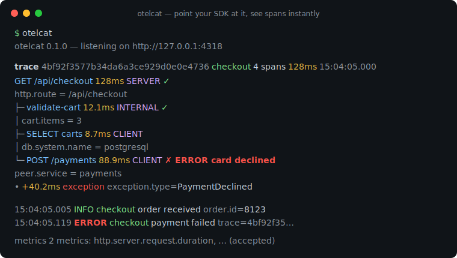
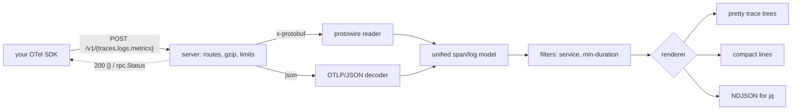

# otelcat

[English](README.md) | [中文](README.zh.md) | [日本語](README.ja.md)

[](LICENSE) [](go.mod) [](CHANGELOG.md)  [](CONTRIBUTING.md)

**otelcat：an open-source, zero-dependency terminal sink for OTLP — point your SDK at http://127.0.0.1:4318 and see spans pretty-printed instantly, no Collector, no Jaeger, no YAML.**



```bash
git clone https://github.com/JaydenCJ/otelcat && cd otelcat
go build -o otelcat ./cmd/otelcat    # single static binary, stdlib only
```

> Pre-release: v0.1.0 is not tagged on a package registry yet; build from source as above (any Go ≥1.22).

## Why otelcat?

Every OpenTelemetry adopter's first hour is the same question: *"is my SDK even emitting?"* The standard answers are all oversized for it. Spinning up a Collector plus Jaeger means a config file, two containers and a browser tab — to check one span. The Collector's own debug exporter still needs the Collector and its YAML. `otel-cli` solves the opposite problem (it *sends* spans, it can't receive yours). And the SDK's console exporter means editing your app's exporter wiring — the exact code you're trying to validate — instead of observing what actually leaves the process. otelcat is the missing `netcat` for OTLP: one binary, zero config, zero dependencies. It listens on the port your SDK already defaults to, speaks both OTLP/HTTP encodings (protobuf via a hand-written wire decoder — no generated code, no protobuf runtime), and renders each batch as a colored per-trace tree with durations, status, attributes, events and correlated logs, the moment it arrives.

| | otelcat | Collector + debug exporter | Jaeger all-in-one | otel-cli | SDK console exporter |
|---|---|---|---|---|---|
| Receives OTLP over HTTP (protobuf + JSON) | ✅ | ✅ | ✅ | ❌ sender only | n/a |
| Zero config to first span | ✅ | ❌ YAML required | ❌ container + UI | n/a | ❌ code change |
| Shows spans in the terminal, live | ✅ trace trees | ⚠️ raw dumps | ❌ browser | ❌ | ⚠️ raw dumps |
| Observes the real export path | ✅ | ✅ | ✅ | ❌ | ❌ bypasses exporter |
| Runtime dependencies | 0 | ~200 Go modules | container image | 1 binary | your SDK |
| Binary size | ~6 MB stripped | >200 MB | >60 MB image | ~9 MB | n/a |

<sub>Dependency counts checked 2026-07-13: otelcat imports the Go standard library only; opentelemetry-collector's core `go.mod` lists ~200 modules before any distribution is built.</sub>

## Features

- **Instant trace trees** — every export batch renders immediately as a per-trace tree: parent/child guides, start-time ordering, aligned human durations (`4.2µs`, `12.3ms`, `2m03s`), kind tags, `✓`/`✗` status with the error message inline.
- **Both wire encodings, no protobuf runtime** — `application/x-protobuf` is decoded by a hand-written ~150-line wire-format reader that skips unknown fields, so payloads from SDKs newer than otelcat still decode; `application/json` absorbs the mapping's sharp edges (hex ids, string-or-number int64, enum names, gzip bodies).
- **Logs and metrics too** — log records print with severity bands, service and `trace=` correlation; metrics batches are acknowledged and summarized so SDK metric exporters never error out.
- **Three output modes** — `pretty` for humans, `compact` for one-line-per-span grepping, `json` for stable NDJSON into `jq`; telemetry goes to stdout, everything else to stderr, so pipes stay clean.
- **Filters for noisy systems** — `--service checkout` isolates one service, `--min-duration 100ms` keeps whole slow traces (never punching holes in a tree), `--no-attrs`/`--no-events`/`--resource` tune the detail level.
- **Honest with broken input** — malformed payloads get a spec-shaped `google.rpc.Status` error plus one stderr diagnostic line, orphan spans are flagged instead of dropped, inverted timestamps clamp to 0 instead of rendering as 584 years, and the sink never dies on bad input.
- **Zero dependencies, zero telemetry** — Go standard library only; binds `127.0.0.1` by default and never makes an outbound connection. A sink that phones home would be absurd.

## Quickstart

```bash
# terminal 1 — the sink (SDK default port, so usually no flags at all)
./otelcat

# terminal 2 — your app, unmodified, via standard env vars
export OTEL_EXPORTER_OTLP_ENDPOINT=http://127.0.0.1:4318
export OTEL_EXPORTER_OTLP_PROTOCOL=http/protobuf
your-instrumented-app
# (no app handy? `go run ./examples/sendspan` posts a demo trace)
```

Real captured output:

```text
trace 4bf92f3577b34da6a3ce929d0e0e4736  checkout  4 spans  128ms  15:04:05.000
  GET /api/checkout    128ms  SERVER    ✓
       http.request.method = GET
       http.route = /api/checkout
       http.response.status_code = 200
  ├─ validate-cart    12.1ms  INTERNAL  ✓
  │       cart.items = 3
  ├─ SELECT carts      8.7ms  CLIENT
  │       db.system.name = postgresql
  └─ POST /payments   88.9ms  CLIENT    ✗ ERROR card declined
          http.request.method = POST
          peer.service = payments
          • +40.2ms exception  exception.type=PaymentDeclined

15:04:05.005  INFO   checkout  order received  order.id=8123  trace=4bf92f35…
15:04:05.119  ERROR  checkout  payment failed  order.id=8123  trace=4bf92f35…
metrics 2 metrics: http.server.request.duration, cart.items.count (accepted; rendering data points is on the roadmap)
```

Pipe spans into `jq` (real output, one JSON object per span):

```bash
./otelcat --output json | jq -r 'select(.status=="ERROR") | .name'
```

```text
POST /payments
```

On Ctrl-C the sink reports what it saw (to stderr):

```text
otelcat: 3 requests, 4 spans, 2 log records, 2 metrics received. bye.
```

## CLI reference

`otelcat [flags]` — it is a server; there are no subcommands. Exit codes: 0 ok, 1 runtime error, 2 usage error.

| Flag | Default | Effect |
|---|---|---|
| `--addr` | `127.0.0.1:4318` | listen address; `:0` picks a random port and prints it |
| `--output` | `pretty` | `pretty`, `compact` (one line/span), or `json` (NDJSON) |
| `--color` | `auto` | `auto` (TTY + `NO_COLOR` aware), `always`, `never` |
| `--service` | — | only show spans/logs whose `service.name` equals this |
| `--min-duration` | `0` | only show traces containing a span at least this long, e.g. `100ms` |
| `--no-attrs` | off | hide span and log attributes |
| `--no-events` | off | hide span events |
| `--resource` | off | also print resource attributes |
| `--max-body` | `16777216` | request body limit in bytes, after gzip decompression |
| `--version` | — | print `otelcat 0.1.0` and exit |

## OTLP support

All three OTLP/HTTP signal routes are served: traces and logs render fully; metrics are accepted and summarized (data-point rendering is a roadmap item, but your SDK's metric exporter gets a clean 200 instead of connection errors). The full field-by-field matrix, including what is deliberately skipped, lives in [docs/otlp-support.md](docs/otlp-support.md). OTLP/gRPC on `:4317` is not implemented in 0.1.0 — set `OTEL_EXPORTER_OTLP_PROTOCOL=http/protobuf`, which every official SDK supports.

## Verification

This repository ships no CI; every claim above is verified by local runs:

```bash
go test ./...            # 92 deterministic tests, offline, < 5 s
bash scripts/smoke.sh    # boots the sink, delivers both encodings, prints SMOKE OK
```

## Architecture



## Roadmap

- [x] v0.1.0 — OTLP/HTTP sink (protobuf + JSON + gzip), pretty/compact/json rendering of traces and logs, metrics acknowledgement, filters, 92 tests + smoke script
- [ ] OTLP/gRPC receiver on `:4317`
- [ ] Metric data-point rendering (gauges, sums, histogram sparklines)
- [ ] Cross-batch trace assembly with a small reorder window
- [ ] `--expect` assertions for CI ("fail unless a span named X arrives in 10s")
- [ ] Write-through mode: tee raw payloads to files for replay

See the [open issues](https://github.com/JaydenCJ/otelcat/issues) for the full list.

## Contributing

Issues, discussions and pull requests are welcome — see [CONTRIBUTING.md](CONTRIBUTING.md) for the local workflow (format, vet, tests, `SMOKE OK`). Good entry points are labelled [good first issue](https://github.com/JaydenCJ/otelcat/issues?q=is%3Aissue+is%3Aopen+label%3A%22good+first+issue%22), and design questions live in [Discussions](https://github.com/JaydenCJ/otelcat/discussions).

## License

[MIT](LICENSE)
