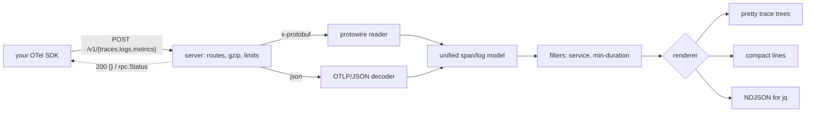

# otelcat

[English](README.md) | [中文](README.zh.md) | [日本語](README.ja.md)

[](LICENSE) [](go.mod) [](CHANGELOG.md)  [](CONTRIBUTING.md)

**otelcat：开源、零依赖的 OTLP 终端接收器 —— 把 SDK 指向 http://127.0.0.1:4318，span 立刻在终端里漂亮地打印出来。不用 Collector，不用 Jaeger，不用 YAML。**


```bash
git clone https://github.com/JaydenCJ/otelcat && cd otelcat
go build -o otelcat ./cmd/otelcat    # single static binary, stdlib only
```

> 预发布提示：v0.1.0 尚未发布到任何软件源；请按上述方式从源码构建（Go ≥1.22 均可）。

## 为什么选 otelcat？

每个 OpenTelemetry 新用户的第一小时都是同一个问题：*“我的 SDK 到底在发数据吗？”* 现有的标准答案对这个问题全都太重了。起一套 Collector 加 Jaeger 意味着一份配置文件、两个容器和一个浏览器标签页——只为看一个 span。Collector 自带的 debug exporter 仍然需要 Collector 和它的 YAML。`otel-cli` 解决的是相反的问题（它负责*发送* span，收不了你的）。而 SDK 的 console exporter 意味着改动应用里的 exporter 接线——恰恰是你想验证的那段代码——而不是观察真正离开进程的东西。otelcat 就是 OTLP 缺失的那个 `netcat`：一个二进制、零配置、零依赖。它监听 SDK 本来就默认的端口，支持 OTLP/HTTP 的两种编码（protobuf 用手写 wire 解码器——没有生成代码，没有 protobuf 运行时），并在每个批次到达的瞬间以彩色的按 trace 分组的树渲染出来：耗时、状态、属性、事件和关联日志一应俱全。

| | otelcat | Collector + debug exporter | Jaeger all-in-one | otel-cli | SDK console exporter |
|---|---|---|---|---|---|
| 接收 OTLP over HTTP（protobuf + JSON） | ✅ | ✅ | ✅ | ❌ 只能发送 | n/a |
| 到第一个 span 零配置 | ✅ | ❌ 需要 YAML | ❌ 容器 + UI | n/a | ❌ 要改代码 |
| 终端里实时看 span | ✅ trace 树 | ⚠️ 原始转储 | ❌ 浏览器 | ❌ | ⚠️ 原始转储 |
| 观察真实的导出链路 | ✅ | ✅ | ✅ | ❌ | ❌ 绕过 exporter |
| 运行时依赖 | 0 | 约 200 个 Go 模块 | 容器镜像 | 1 个二进制 | 你的 SDK |
| 二进制体积 | strip 后约 6 MB | >200 MB | >60 MB 镜像 | 约 9 MB | n/a |

<sub>依赖数量核查于 2026-07-13：otelcat 只导入 Go 标准库；opentelemetry-collector 核心 `go.mod` 在构建任何发行版之前就已列出约 200 个模块。</sub>

## 功能

- **即时 trace 树** —— 每个导出批次立刻渲染为按 trace 分组的树：父子引导线、按开始时间排序、对齐的人类可读耗时（`4.2µs`、`12.3ms`、`2m03s`）、kind 标签、`✓`/`✗` 状态并内联错误信息。
- **两种 wire 编码，不带 protobuf 运行时** —— `application/x-protobuf` 由一个手写的约 150 行 wire 格式读取器解码，未知字段自动跳过，因此比 otelcat 更新的 SDK 发来的负载也能解码；`application/json` 消化了该映射的所有尖角（十六进制 id、字符串或数字形式的 int64、枚举名、gzip 请求体）。
- **日志和指标也能收** —— 日志记录带严重级别、服务名和 `trace=` 关联打印；指标批次会被确认并汇总，SDK 的指标导出器永远不会报错。
- **三种输出模式** —— `pretty` 给人看，`compact` 一行一个 span 方便 grep，`json` 输出稳定的 NDJSON 直接进 `jq`；遥测数据走 stdout，其余全部走 stderr，管道始终干净。
- **为嘈杂系统准备的过滤器** —— `--service checkout` 隔离单个服务，`--min-duration 100ms` 保留整条慢 trace（绝不在树上打洞），`--no-attrs`/`--no-events`/`--resource` 调节细节量。
- **对坏输入诚实** —— 畸形负载会收到符合规范的 `google.rpc.Status` 错误外加一行 stderr 诊断，孤儿 span 会被标记而不是丢弃，时间戳倒挂钳制为 0 而不是渲染成 584 年，接收器绝不会因坏输入而挂掉。
- **零依赖、零遥测** —— 仅 Go 标准库；默认绑定 `127.0.0.1`，永不发起出站连接。一个会打电话回家的接收器未免太荒谬。

## 快速开始

```bash
# terminal 1 — the sink (SDK default port, so usually no flags at all)
./otelcat

# terminal 2 — your app, unmodified, via standard env vars
export OTEL_EXPORTER_OTLP_ENDPOINT=http://127.0.0.1:4318
export OTEL_EXPORTER_OTLP_PROTOCOL=http/protobuf
your-instrumented-app
# (no app handy? `go run ./examples/sendspan` posts a demo trace)
```

真实捕获的输出：

```text
trace 4bf92f3577b34da6a3ce929d0e0e4736  checkout  4 spans  128ms  15:04:05.000
  GET /api/checkout    128ms  SERVER    ✓
       http.request.method = GET
       http.route = /api/checkout
       http.response.status_code = 200
  ├─ validate-cart    12.1ms  INTERNAL  ✓
  │       cart.items = 3
  ├─ SELECT carts      8.7ms  CLIENT
  │       db.system.name = postgresql
  └─ POST /payments   88.9ms  CLIENT    ✗ ERROR card declined
          http.request.method = POST
          peer.service = payments
          • +40.2ms exception  exception.type=PaymentDeclined

15:04:05.005  INFO   checkout  order received  order.id=8123  trace=4bf92f35…
15:04:05.119  ERROR  checkout  payment failed  order.id=8123  trace=4bf92f35…
metrics 2 metrics: http.server.request.duration, cart.items.count (accepted; rendering data points is on the roadmap)
```

把 span 用管道送进 `jq`（真实输出，每个 span 一个 JSON 对象）：

```bash
./otelcat --output json | jq -r 'select(.status=="ERROR") | .name'
```

```text
POST /payments
```

按 Ctrl-C 时接收器会汇报它看到了什么（输出到 stderr）：

```text
otelcat: 3 requests, 4 spans, 2 log records, 2 metrics received. bye.
```

## CLI 参考

`otelcat [flags]` —— 它是一个服务器，没有子命令。退出码：0 正常，1 运行时错误，2 用法错误。

| 参数 | 默认值 | 作用 |
|---|---|---|
| `--addr` | `127.0.0.1:4318` | 监听地址；`:0` 表示随机端口并打印出来 |
| `--output` | `pretty` | `pretty`、`compact`（一行一个 span）或 `json`（NDJSON） |
| `--color` | `auto` | `auto`（感知 TTY 与 `NO_COLOR`）、`always`、`never` |
| `--service` | — | 只显示 `service.name` 等于此值的 span/日志 |
| `--min-duration` | `0` | 只显示包含至少这么长的 span 的 trace，如 `100ms` |
| `--no-attrs` | 关 | 隐藏 span 和日志的属性 |
| `--no-events` | 关 | 隐藏 span 事件 |
| `--resource` | 关 | 同时打印 resource 属性 |
| `--max-body` | `16777216` | 请求体字节上限，按 gzip 解压后计 |
| `--version` | — | 打印 `otelcat 0.1.0` 并退出 |

## OTLP 支持

三条 OTLP/HTTP 信号路由全部提供服务：trace 和日志完整渲染；指标被接收并汇总（数据点渲染在路线图上，但你的 SDK 指标导出器拿到的是干净的 200 而不是连接错误）。逐字段的完整支持矩阵——包括刻意跳过的部分——见 [docs/otlp-support.md](docs/otlp-support.md)。0.1.0 未实现 `:4317` 上的 OTLP/gRPC——请设置 `OTEL_EXPORTER_OTLP_PROTOCOL=http/protobuf`，所有官方 SDK 都支持。

## 验证

本仓库不带 CI；上述所有声明均由本地运行验证：

```bash
go test ./...            # 92 deterministic tests, offline, < 5 s
bash scripts/smoke.sh    # boots the sink, delivers both encodings, prints SMOKE OK
```

## 架构



## 路线图

- [x] v0.1.0 —— OTLP/HTTP 接收器（protobuf + JSON + gzip）、trace 与日志的 pretty/compact/json 渲染、指标确认、过滤器、92 个测试 + smoke 脚本
- [ ] `:4317` 上的 OTLP/gRPC 接收器
- [ ] 指标数据点渲染（gauge、sum、histogram 火花线）
- [ ] 带小型重排窗口的跨批次 trace 组装
- [ ] 面向 CI 的 `--expect` 断言（“10 秒内没收到名为 X 的 span 就失败”）
- [ ] 透写模式：把原始负载 tee 到文件以便回放

完整列表见 [open issues](https://github.com/JaydenCJ/otelcat/issues)。

## 参与贡献

欢迎 issue、讨论和 PR —— 本地工作流（格式化、vet、测试、`SMOKE OK`）见 [CONTRIBUTING.md](CONTRIBUTING.md)。入门任务标记为 [good first issue](https://github.com/JaydenCJ/otelcat/issues?q=is%3Aissue+is%3Aopen+label%3A%22good+first+issue%22)，设计讨论在 [Discussions](https://github.com/JaydenCJ/otelcat/discussions)。

## 许可证

[MIT](LICENSE)
